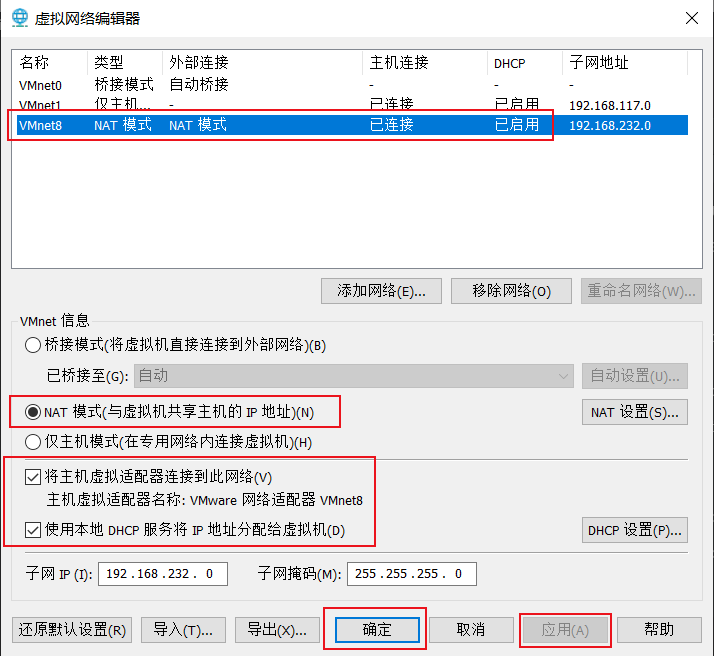
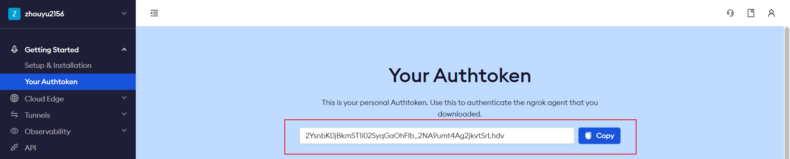
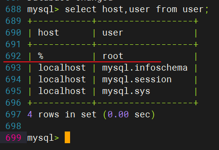
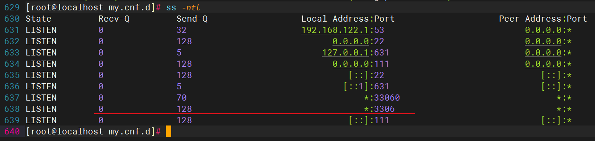
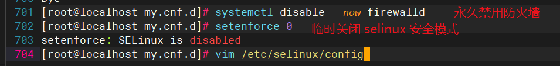

<GradientTitle text="红帽 8 云计算学习笔记"/>

> 红帽 8 安装教程博客推荐：https://blog.csdn.net/low5252/article/details/101035853


## 一、包管理器配置


### 1、官网注册账号并订阅

> 注意：注册好账户后，要完善信息，并进行订阅

> 官网地址：https://developers.redhat.com/


### 2、配置yum包管理

```bash
$ subscription-manager register --username=账户名称 --password='账户对应的密码' --auto-attach	# 终端登录红帽子账号
$ yum repolist		# 查看仓库名称
$ yum install -y lrzsz		# 配置好仓库后，下载安装这个软件，便于后面Linux服务器和本地window电脑进行上传和下载
```


### *3、XShell的下载和配置

> 官网下载地址：https://www.xshell.com/zh/xshell/

> 在Linux上用以下命令查看 ipv4 地址

```bash
$ ip a
[BaseOS]
name=BaseOS
baseurl=file:///media/cdrom/BaseOS
enabled=1
gpgcheck=0

[AppStream]
name=AppStream
baseurl=file:///media/cdrom/AppStream
enabled=1
gpgcheck=0
```

> 将ip地址填写到XShell上，然后填写Linux用户名和密码即可进行连接

### 4、本地上传文件到Linux

```bash
$ rz 回车		# 即可从本地开始选择文件直接上传啦
```


### 5、从Linux下载文件到本地

```bash
$ sz 要下载的目标文件
```


### 6、WindTerm工具

> 推荐好用的 Shell 工具（不同的颜色高亮标识命令、关键字等，很炫酷）：<a href="https://kingtoolbox.github.io/">下载地址</a>


## 二、网络配置

### 1、Linux三种网络配置的区别

- NAT模式：虚拟机借助物理机进行路由器联网

- 桥接模式：虚拟机直接连接路由器，与物理机是对等地位

- 仅主机模式：不能联网，只能 ping 通虚拟机

> 详细说明：

1. 桥接模式相当于把虚拟机变成一台完全独立的计算机，会占用局域网本网段的一个IP地址，并且可以和网段内其他终端进行通信，相互访问。（虚拟机要连接打印机，请使用桥接模式！）
2. NAT模式与外界通话需要经过物理机(的NAT转换)，不会多占一个局域网IP，默认情况下外部终端也无法直接访问虚拟机。
3. 仅主机模式不能上网，互联网局域网都不行，只能与物理机对话。

> 参考博客：NAT参考这篇文章你就明白了：https://baijiahao.baidu.com/s?id=1726792174464807810&wfr=spider&for=pc


### 2、配置网卡的4种方式

> 检查网络管理服务配置和状态：systemctl status NetworkManager

1. 网卡配置文件（每个人最后的文件的文件名可能有所不同）：ls /etc/sysconfig/network-scripts/ifcfg-ens160
2. 图形化配置工具：和window一样点击Linux桌面窗口上的图标就能进行操作，很简单
3. nmtui伪图形配置工具（依赖NetworkManager服务）：该命令会进入伪图形界面>然后选择编辑Edit xxx的选项>选择Ethernet
4. nmcli命令行


### 3、市面上提供的DNS服务器IP

1. 阿里DNS解析服务器：223.5.5.5	223.6.6.6
2. 电信DNS：114.114.144.114
3. GoogleDNS：8.8.8.8	8.8.4.4
4. OpenDNS:208.67.222.222	208.67.220.220
5. 激活web控制台:ctrl + alt + F4


### *4、命令行的方式配置网络（重点）

```bash
$ nmcli device  (简写d) help	# 查看该工具的命令帮助
$ nmcli connection  (简写c) help
```


### 5、网卡配置操作

- [x] 网卡配置前提：（一定要勾选上，再重启一下）




```bash
$ systemctl status NetworkManager		# 查网络管理服务状态
$ systemctl start NetworkManager		# 如果没有启动，就启动它
$ nmcli n on							# 打开网络管理服务开关
$ nmcli d status	# 网卡状态列表
$ nmcli d show		# 显示网卡详情
$ nmcli d show ens160	# 筛选查看具体网卡详情
$ nmcli d disconnect ens160	# 断开网卡连接
$ nmcli d connect ens160	# 连接网卡
```


### 6、网卡连接的操作

```bash
$ nmcli c show	# 展示连接对象详情
$ nmcli c up ens160	# 激活网卡连接
$ nmcli c add type ethernet con-name ens160_c1 ifname ens160 ipv4.method auto	# 添加连接
	添加 类型为ethernet 连接名是ens160_c1	设备是ens160	ipv4连接方式为自动
$ nmcli c up ens160_c1	# 激活连接
$ nmcli d show ens160_c1	# 显示连接详情
$ nmcli c modify ens160_c1 ipv4.address 192.168.132.20/24	# 修改ip地址和子网掩码才能和windows上的255.255.255.0的子网掩码相匹配，XShell中才能连接上
```


### 7、通过命令修改连接的配置文件

```bash
$ nmcli c edit ens160_c1		 # 进入网络连接配置文件进行编辑配置
$ nmcli>goto address			 # 跳到属性字段
$ nmcli ipv4.address>back		 # 用于返回上一层级
$ nmcli>print					# 打印该层级或字段包含的内容
$ nmcli>?						# 查看nmcli编辑器有哪些命令
```


### 8、小结

1. 网络配置主要内容：
   	（1）、修改配置文件（配置文件/etc/sysconfig/network-scripts/ifcfg-xxx）
    （2）、图形化配置（了解就行）
    （3）、nmtui伪图形终端（一定要掌握）
    （4）、nmcli（很重要！网卡设备详情/连接，连接添加/修改/删除/激活）

2. 网络配置成为高手的三个阶段：按照文档配置服务器网络   ->   排查网络故障   ->   规划网络配置

3. 网络问题排查：

    1、检查vm网络模式
    2、检查网络管理服务是否开启：systemctl status NetworkManager
    3、检查网卡是否启用：nmcli d show
    4、检查连接是否启用：nmcli c show
    5、检查连接配置参数（主要是ipv4配置信息）：nmcli c show 连接名
    		ping	# 检查网络联通性（局域网，网关，互联网【域名/ip】）

    ​					# DNS解析


### 9、扩展

1. 查看状态：systemctl status NetworkManager
2. 启动：systemctl start NetworkManager
3. 重启：systemctl restart NetworkManager
4. 关闭：systemctl stop NetworkManager
5. 查看是否开机启动：systemctl is-enabled NetworkManager
6. 开机启动：systemctl enable NetworkManager
7. 禁止开机启动：systemctl disable NetworkManager


#### （1）查看当前网络接口摘要

```bash
$ nmcli d status	# 列出所有网络设备接口
$ nmcli c show		# 列出系统上的活动接口
```


#### （2）更易于阅读的格式输出

```bash
$ nmcli -p d		# 第一种方式（简写 d 代表 device）
$ nmcli -p device	# 第二种方式
```


#### （3）nmcli命令配置静态IP

> 原因：不配置静态IP的话，DHCP每次分配给我们的都是动态IP地址，这对我们使用远程方式访问服务器会造成影响

> 分配静态IP之前先检查系统的当前IP地址，然后再进行配置（可以分部也可以一次性配置所有内容）

```bash
$ ifconfig			# 查看自己拥有的网卡信息

# 一键配置 静态IP地址 并 启用
$ nmcli c add type ethernet con-name "static_conn" ifname ens160 ipv4.addresses 192.168.232.20/24 gw4 192.168.232.2 ipv4.dns "8.8.8.8 114.114.114.114" ipv4.method manual autoconnect yes && nmcli c up static_conn
# 激活连接
$ nmcli c up static_conn [ifname ens160]（表示可以省略）
# 查看当前激活连接的IP
$ ip addr 或者 ip a
# 禁用连接
$ nmcli c down id static_conn
# 有关nmcli的帮助
$ nmcli --help
```


## 三、软件安装

### 1、软件包分类

- 源码包（如C语言源码文件）
- 二进制包（如RPM包、系统默认包这种已经经过编译的源码包）

- Linux三种常见软件包的格式：rpm、deb、tar.gz
- 软件包搜索和下载网站：https://www.rpmfind.net/


### 2、软件安装

#### rpm的使用

| 命令                | 解释                                                    |
| ------------------- | ------------------------------------------------------- |
| rpm -ivh 包名       | 安装 rpm 包                                             |
| rpm -e 包名         | 卸载 rpm 包                                             |


**（1）自己独立安装并解决依赖问题（有些时候可能比较繁琐）**

> ① 首先查看自己的系统版本

```bash
$ uname -a
```

> ② 下载并安装软件包

```bash
$ rpm -ivh 软件包的下载地址
```

> ③ 查询

```bash
$ rpm -qa | grep 软件包名
```

> ④ 卸载

```bash
$ rpm -e 软件包名
```


#### yum的使用

**（2）yum自动从指定的服务器下载并自动解决依赖问题（比较方便，只要配置好，后面就一劳永逸很方便）**

> yum 仓库（源）配置文件路径：/etc/yum.repos.d/ .repo结尾
>
> 在包管理器学习章节中，我们配置了红帽子的包管理器这里应该就会有一个 redhat.repo（注意不能手动去设置）仓库源配置文件，当然还可以配置其他仓库源


### 3、yum 仓库镜像源配置

#### （1）yum常用命令和功能解释

| 命令                | 解释                                                        |
| ------------------- | ----------------------------------------------------------- |
| yum install -y 包名 | 下载安装过程中需要询问『yes/no』 的全部问题均自动回答为 yes |
| yum install 包名    | 下载安装过程中，可以手动回复 『yes/no』的咨询               |
| yum remove 包名     | 移除包                                                      |
| yum repolist        | 查看可用的仓库                                              |
| yum localinstall    | 本地 rpm 包安装                                             |
| yum search 软件包名 | 搜索软件包                                                  |
| yum clean all       | 清除 YUM 缓存                                               |
| yum makecache       | 更新 YUM 缓存源                                             |


#### （2）开胃菜

>  如果已经有仓库源了，不妨试试几个『开胃菜』吧~

- (1)安装小火车（开胃菜）


```bash
$ yum install -y sl		# 安装 『小火车』 
$ sl					# 该命令可以直接运行小火车，小火车图形会动态地从终端屏幕上从右往左开过去
```

- (2)安装

```bash
$ yum install -y cowsay		# 安装 『牛说话工具』
$ cowsay "Hello World!"		# 牛说话命令 "内容"
```

```bash
$ yum install -y btop	
$ btop				# 启动系统监控，该工具可以面板形式展示内存、进程、磁盘等使用情况，退出按『ESC』键
```


> 为什么要使用镜像源来下载软件包？因为 yum 的仓库官网在国外，通过外网下载要经过漫长的海底光缆，而海底光缆的网速又贼慢，所以没办法，为了方便下载，国内的一些大厂都搭建了同步国外仓库资源的镜像网站，镜像源站点会每隔一段时间就会自动将国外仓库的资源同步更新过来，这样我们在国内也能高速下载和国外仓库源一样的软件等资源了。

> 接下来我们就说一下怎么配置 yum 仓库吧~


#### （3）配置镜像源

> 配置镜像源之前的准备工作

进入 YUM 仓库源配置文件

```bash
$ cd /etc/yum.repos.d/
```

查看当前系统拥有的仓库源配置文件

```bash
$ ls		# 这里我们是进入了 /etc/yum.repos.d/ 这个文件的，如果没有进入该文件，那就都需要指明是在这个路径下才行。比如在其他路径要查看仓库源配置文件可以这样 ls /etc/yum.repos.d/
```

备份 YUM 仓库源的所有配置文件，以免后续操作失误可以恢复

```bash
$ mkdir /etc/yum.repos.d/backup		# 先创建一个备份目录
$ cp /etc/yum.repos.d/*	/etc/yum.repos.d/backup		# 将仓库源配置文件都复制一份到该备份目录中
```


##### （1）配置『阿里云镜像源』仓库：

```bash
$ wget -O /etc/yum.repos.d/CentOS-Base.repo https://mirrors.aliyun.com/repo/Centos-vault-8.5.2111.repo
```

不同版本的阿里云镜像源配置文件去这里查看如何下载：https://developer.aliyun.com/mirror/centos


##### （2）配置『清华园镜像源』仓库：


##### （3）配置『腾讯云镜像源』仓库：


> 参考博客：https://www.python100.com/html/70757.html


### 4、下载『黑客帝国雨』源码包

```bash
$ mkdir /opt/src	# 创建该目录，之后我们将把文件下载到这个目录里
$ cd /opt/src		# 进入该目录
$ pwd				# 查看一下当前路径
$ wget https://jaist.dl.sourceforge.net/project/cmatrix/cmatrix/1.2a/cmatrix-1.2a.tar.gz	# 下载『黑客帝国雨』代码压缩包
$ tar -xzvf cmatrix-1.2a.tar.gz 	# 解压该压缩包
$ ll							  # 可以查看一下当前目录拥有哪些文件
$ cd cmatrix-1.2a/					# 进入该目录
$ ll			   				    # 查看一下有哪些文件
$ vim cmatrix.c						 # 可以打开查看一下该文件内容
$ yum -y install gcc automake autoconf libtool make		# 安装 C语言编译环境
$ yum -y install ncurses-devel		   # 安装依赖
$ ./configure --prefix=/opt/cmatrix		# 有了编译环境之后，对配置文件 configure 指定编译后生成的文件存放的位置，类似于 windows 上指定文件要存放的位置一样
$ make	# 编译
$ make install	# 安装
$ ll /opt/cmatrix/		# 可以看到有个 bin 目录，即我们的编译生成的 可执行文件存放的位置
$ /opt/cmatrix/bin/cmatrix	# 直接运行该可执行文件

$ sudo dnf groupinstall 'development tools'
$ sudo dnf install bzip2-devel expat-devel gdbm-devel ncurses-devel openssl-devel readline-devel sqlite-devel tk-devel xz-devel zlib-devel wget
$ VERSION=3.8.2
$ wget https://www.python.org/ftp/python/${VERSION}/Python-${VERSION}.tgz
$ tar -xf Python-${VERSION}.tgz
$ cd Python-${VERSION}
$ ./configure --enable-optimizations
$ make -j 2
$ sudo make altinstall
$ python3.8 --version
```


## 四、Web应用


### 1、URI 和 URL 的概念

- URI 即统一资源定位符（Uniform Resource Identifier）
- URL即统一资源定位系统（Uniform Resource Locator）

> 1. URI 范围 > URL 范围
>
> > URI 表示的可以是本地资源，比如 C 盘下的某文件的绝对路径
> >
> > ```bash
> > # 例如下面这种也是囊括在 URI 范围中的
> > file:///E:/Desktop/index.html
> > ```
> >
> > 
>
> 2. URL一般用于描述浏览器上的网址
>
> > \[协议类型\]://\[主机地址\]:\[端口号\]/\[资源层级 Unix 文件路径 \]/\[文件名\]?\[查询字符串\]
> >
> > ```bash
> > # 例如	?表示要 url 中要提交的参数，用 & 连接多个查询参数
> > # 另外，在 http 协议中，默认 80 是主机的端口，URL 写到 主机地址 就表示 80 端口了
> > # 	   在 https 协议中，默认 443 是主机的端口，URL 写到 主机地址 就表示 443 端口了
> > http://127.0.0.1:80/login.html?username=zy&password=123456
> > ```
> >
> > 


### 2、主流Web服务器：

1. Apache官网：https://httpd.apache.org/
2. Tomcat官网：https://tomcat.apache.org/
3. Nginx官网：http://nginx.org/

Apache：世界使用排名第一的Web服务器，简单、速度快、性能稳定

Tomcat：支持最新的Servlet 2.4 和JSP 2.0 规范，技术先进、性能稳定，免费，Java常用

Nginx：稳定（7天*24小时）、性能高、可用作反向代理服务器


### 3、安装 Web 服务器


````bash
$ yum install -y nginx		# 安装 Nginx 服务器
$ systemctl status nginx	# 查看 Nginx 服务状态，此时显示未启动的状态
$ systemctl start nginx		# 启动 Nginx 服务
$ systemctl stop firewalld	# 需要关闭防火墙
                            # 关闭 selinux
                                # 安全模式：DAC(自主访问控制): 用户权限
                                # 		  MAC(强制访问控制)：进程权限
                                # 	临时关闭：setenforce 0
                                # 	永久关闭：vim /etc/selinux/config
$ ip a					   # 查看本机 ip 地址，然后就可以去浏览器上输入 该ipv4地址 查看该服务器提供的资源了
$ cd /usr/share/nginx/html/		# Nginx 默认的向外提供访问资源的文件目录
$ ll						# 查看一下该目录下有哪些文件
$ rz						# 在 XShell 中，我们可以通过 rz 命令就可以选择上传 windows 上的资源到该目录下，这样我们的windows上开发好的项目就可以部署到本地服务器啦，当然也就可以在 windows 电脑上的浏览器去访问啦
````


### 4、<a name="ip-domain">设置本地域名 - ip地址解析</a>

> 不知道屏幕前的你是否玩过英雄联盟，如果你玩过英雄联盟，你就知道这种在本地设置『域名 - ip地址』的技术其实就类似于『英雄联盟皮肤盒子』的效果，只能在本机上用该域名访问，在实际去访问的时候，本地会先对这个访问的域名做一个解析从而得到 IP 地址，再去访问并获得地址对应的资源。下面就介绍怎么配置 『域名 - ip地址』的映射关系。

（1）在 windows 电脑上，打开 『我的电脑』，找到如下文件：

> C:\\\\Windows\\\\System32\\\\drivers\\\\etc\\\\hosts

（2）因为 windows 不允许直接修改 hosts 文件，所以我们可以先将 hosts 文件复制到桌面上，然后对这个复制出来的文件进行修改，之后再把它粘贴到原来所在的位置进行覆盖即可，这样就间接修改掉这个 hosts 文件啦！

```bash
# 在 hosts 文件的最后添加如下内容

# 中间是 windows 本机自己的内容，不用管！！！

# ---------云计算系统管理测试域名解析------------
# 在最后添加自己 Linux 上用 ip a 命令查看到的 ipv4 地址，后面是自己自定义的域名
# 配置好『ip地址 - 域名』的映射关系后，就可以保存该文件，然后把它粘贴覆盖到原来所在的位置
# 在浏览器输入该域名也可以和访问这个 IP 地址一样的效果
192.168.232.128     www.zhouyu.com
```


## 五、服务器配置


#### 1、购买域名

- 域名	映射	ip
- 域名有一个即可，可创建出一级域名、二级域名


#### 2、本地域名解析配置

1. 作用

	> （1）本地解析更快
	>
	> （2）节省[DNS]()服务器压力
	>
	> （3）自己『本地Linux服务器』的 [ip]() 还可以自定义域名来访问！！！

2. 开始配置

	> 配置[本地Linux上的服务器]()

	```bash
	$ systemctl status	nginx	# 查看 nginx 服务的状态
	$ systemctl start nginx		# 如果是失活『dead』状态的话，启动 nginx 服务
	$ systemctl stop firewalld		# 本次开机中临时关闭防火墙
	$ systemctl disable firewalld	# 永久禁用防火墙（下次开机就不用再关闭防火墙服务啦）
	$ setenforce 0 		# 临时关闭 selinux 安全模式（SELinux 安全策略在某些时候会限制或阻止外来访问）
	$ vim /etc/selinux/config	# 编辑该文件，永久关闭 selinux 安全模式，下次重启时也生效啦
	                                # SELINUX=enforcing 修改为 SELINUX=disabled
	                                    # SELINUX=disabled——selinux关闭
	                                    # SELINUX=enforcing ——selinux开启并设定为强制状态
	                                    # SELINUX=permissive ——selinux开启并设定为警告状态
	                                    # 注意： selinux开启或关闭需要重启系统才能使设定生效
	$ ip a		# 查看一下配置的静态 IP，要是不会配置静态，可以查看前面的『网络配置』章节（把它记下来，等会儿配置宿主主机 windows 上的本地域名需要用到）
	```


3. 宿主主机配置本地 『ip - 域名』 的映射关系

	> [去阅读本地ip-域名配置](#ip-domain)

	> 推荐下载软件（可选）：[下载地址](https://pan.baidu.com/s/15Cj1xpP7P7YDxpmANEdldg?pwd=5201)
	>
	> 作用：它可以方便的在软件中直接把配置文件加载进来进行修改。


#### 3、Nginx的[Master-Worker]()模式

- 主进程：
  - 管理工作进程
  - 加载配置文件
- 工作进程：[怎么进行数据的交互？（课堂问题）]()
  - 处理具体的请求
  - 互不影响
  - 工作进程退出不影响主进程


#### 4、[nginx配置文件]()说明


- 重要命令

```bash
  $ tail -f /var/log/nginx/error.log		# 实时刷新文件内容，查看最新日志
  $ vim /etc/nginx/nginx.conf				# 配置 nginx 的配置文件
  $ ps -ef | grep nginx					# 查看 nginx 进程
  $ kill -9								# 杀死进程
  
  $ nginx -t								# 修改完配置文件记得测试一下配置文件是否有『语法或配置错误』
  $ nginx -s reload							# 重新加载配置文件
  
  $ mkdir /www && mkdir /www/web			# 这里演示以 /www/web 作为对外资源访问的根路径，当然配置文件配置好了，别忘记创建这个文件目录
  $ cp /usr/share/nginx/html/* /www/web	# 配置好之后，可以尝试将原来的 nginx 服务器根路径下的资源全部复制到当前根路径层级下面
```
- 配置文件内容
  ```txt
     # 该文件中配置了 『全局块 - 全局参数』
     # -------------------------------------

    user nginx;		# 运行进程使用的用户
    worker_processes auto;	# 工作进程数	推荐和CPU核数一致	auto-自动根据核数适应
    # 错误日志，可以通过后面的命令实时刷新错误日志，查看最新的文件信息 tail -f /var/log/nginx/error.log
    error_log /var/log/nginx/error.log;
    pid /run/nginx.pid;		# 进程ID
    
    # 引入动态模块
    # Load dynamic modules. See /usr/share/doc/nginx/README.dynamic.
  include /usr/share/nginx/modules/*.conf;
  
    # events 块	网络参数
    events {
        # 连接数
        worker_connections 1024;
  }
  
    # http 块
    http {
        log_format  main  '$remote_addr - $remote_user [$time_local] "$request" '
        '$status $body_bytes_sent "$http_referer" '
        '"$http_user_agent" "$http_x_forwarded_for"';
    
        access_log  /var/log/nginx/access.log  main;
    
        sendfile            on;
        tcp_nopush          on;
        tcp_nodelay         on;
        keepalive_timeout   65;
        types_hash_max_size 2048;
    
        include             /etc/nginx/mime.types;
        default_type        application/octet-stream;
    
        # Load modular configuration files from the /etc/nginx/conf.d directory.
        # See http://nginx.org/en/docs/ngx_core_module.html#include
        # for more information.
        include /etc/nginx/conf.d/*.conf;
        # 定义虚拟主机
        server {
            listen       80 default_server;				# 定义监听的端口号
            # listen       [::]:80 default_server;		# ipv6的端口配置
    
            # server_name  _;							# 域名	_ 表示所有
            server_name www.zhangsan.com;				# 自己写一个
            
            # 网站根路径,这下面的资源对外暴露，可以访问。默认访问根路径，服务器提供的就是 index.html 文件
            # root         /usr/share/nginx/html;		
            root			/www/web;
    
            # Load configuration files for the default server block.
            include /etc/nginx/default.d/*.conf;
    
            location / {
            }
    
            error_page 404 /404.html;
                location = /40x.html {
            }
    
            error_page 500 502 503 504 /50x.html;
                location = /50x.html {
            }
        }
        # 定义第二个虚拟主机
        server{
            listen 80;
            server_name www.lisi.com;
            root /www/web2;
        }
        # ...
    }
  ```

> 状态码：<code style="color:orange">404</code>: 找不到文件
>
> 状态码：<code style="color:orange">403</code>: （1）访问的是一个目录，目录下没有任何文件
>
> ​			（2）selinux未关闭（未配置）
>
> ​					DAC（自主访问控制）：用户权限
>
> ​					MAC（强制访问控制）：进程权限，对普通/root用户都一视同仁，都需要配置权限才能访问


#### 5、查找配置文件

```bash
$ find / -name nginx.conf		# 从根目录去查找 nginx.conf 这个文件，不记得了文件名可以用 find 命令去查找
```


#### 6、服务器域名及子域名配置

```txt
# /etc/nginx/nginx.conf
server {
    listen 80;
    server_name "~^www\.\w{1,10}\.com$";		# 正则表达式中有使用到花括号{}，需要在外层用双引号""包裹
    root /www/web4;
}
```


> 优先级：精确匹配 > 通配符
>
> 正则：
>
> ​	1、必须以 ~ 开头标识这是一个正则表达式
>
> ​	2、正则表达式以 ^ 开始，$ 结束
>
> ​	3、域名中 . 要使用反斜杠 \ 转义
>
> ​	4、正则表达式中有花括号的话，必须要用双引号引起来


#### 7、location 配置项

| 匹配符 | 匹配规则                     | 优先级 |
| ------ | ---------------------------- | ------ |
| =      | 精确匹配                     | 1      |
| ^~     | 以某个字符串开头             | 2      |
| ~      | 区分大小写的正则匹配         | 3      |
| ~*     | 不区分大小写的正则匹配       | 4      |
| !~     | 区分大小写不匹配的正则       | 5      |
| !~*    | 不区分大小写不匹配的正则     | 6      |
| /      | 通用匹配，任何请求都会匹配到 | 7      |


- `localtion` 拥有的属性

```bash
server {
        listen 80;
        server_name     www.zhaoliu.com;
        root            /www;
        location = /hello/ {
                #root   /www/zhaoliu/2023/11/20;    # 访问该路径时跳转索要资源的根路径
                #alias /www/zhaoliu/2023/11/20/;	# 把匹配路径更换别名
                #index my.html;						# 指定默认访问路径
        }
    }
```


- URL 访问流程

>浏览器输入的URL在服务器上的转换流程：`http://www.lisi.com` -> `http://www.lisi.com/` -> `http://www.lisi.com/index.html`
>
>最终查找资源的路径变为 `http://www.lisi.com/index.html`


```bash
# 配置 /etc/nginx/nginx.conf
$ nginx -t					# 测试配置文件是否正确
$ nginx -s reload			# 保存并重新加载配置文件
$ systemctl restart nginx	# 重启nginx服务

# 新开一个窗口，看日志文件
$ tail -f /var/log/nginx/error.log
```


```bash
http://www.lisi.com/image -> web4

http://www.lisi.com/

$ location ~ /images/.*\.(jpg|png)$ {
	root	/www;
}

$ mkdir /www/images/
$ cd /www/images
$ rz 上传图片文件做实验
```


## 六、LNMP 实训

### 配置静态IP

> 提示: 先查看一下自己虚拟机的网段，然后将下面的网关和IP地址改成自己的就行了

```bash
# 配置第一台服务器的静态IP：该服务安装 Nginx
$ nmcli c add type ethernet con-name "static_conn" ifname ens160 ipv4.addresses 192.168.232.30/24 gw4 192.168.232.2 ipv4.dns "8.8.8.8 114.114.114.114" ipv4.method manual autoconnect && nmcli c up static_conn

# 配置第二台服务器的静态IP：该服务器安装 Python
$ nmcli c add type ethernet con-name "static_conn" ifname ens160 ipv4.addresses 192.168.232.40/24 gw4 192.168.232.2 ipv4.dns "8.8.8.8 114.114.114.114" ipv4.method manual autoconnect && nmcli c up static_conn

# 配置第三台服务器的静态IP：该服务器安装 MySQL
$ nmcli c add type ethernet con-name "static_conn" ifname ens160 ipv4.addresses 192.168.232.50/24 gw4 192.168.232.2 ipv4.dns "8.8.8.8 114.114.114.114" ipv4.method manual autoconnect && nmcli c up static_conn

```


### `Nginx` 安装

```bash
$ yum install -y nginx					# 安装 nginx 服务
$ systemctl status nginx				# 查看 nginx 状态：是否启动
$ systemctl start nginx					# 启动 nginx
$ setenforce 0							# 临时关闭 selinux 安全模式
$ getenforce							# 查看 selinux 是否关闭：Enforcing 防御状态，未关闭；Permissive 开放状态，说明关闭安全模式了
$ systemctl stop firewalld				# 临时关闭防火墙
$ systemctl disable --now firewalld		# 永久禁用防火墙，立即生效
$ ls /usr/share/nginx/html/				# 初次安装的 nginx 服务器，资源的默认共享位置是该目录
$ vim /etc/nginx/nginx.conf				# 修改配置文件，进行更加具体的一些设置

$ sudo lsof -i :80						# 查看占用 80 端口的进程
$ sudo kill -9 [PID]							# -9 表示强制杀死该进程，把端口让出来

```

### 内网穿透

> 免费使用的临时的域名：[Ngrok官网](https://ngrok.com/)，配置好之后，就可以将你的本机映射到公网上，之后就可以进行访问了。

```bash
# 配置内网穿透
$ wget https://bin.equinox.io/c/4VmDzA7iaHb/ngrok-stable-linux-amd64.tgz		# 下载并安装Ngrok
$ tar -xvf ngrok-stable-linux-amd64.tgz
$ ./ngrok authtoken YOUR_AUTH_TOKEN												# 设置Ngrok Authtoken，登录账号获取
$ ./ngrok http 80				# 运行Ngrok进行内网穿透，每次运行都是新的域名
# $ nohup ./ngrok http 80 &		# 允许后台持续运行
$ vim /etc/nginx/nginx.conf		# 设置代理服务器，将外网的请求转发到 pythonweb 服务器
# ...
server {
    listen  80;
    server_name     178d-42-49-200-209.ngrok-free.app;		# 接收访问的域名
    location / {
    	proxy_pass       http://192.168.232.40;				# PythonWeb 服务器地址
    }
}
# ...
$ systemctl -t												# 测试配置文件是否正确
$ systemctl -s reload										# 保存并重新加载
$ systemctl status nginx									# 查看 nginx 运行状态
```

- AuthoToken 获取




### `PythonWeb` 安装


- 安装解释器

```bash
# 安装依赖
$ yum install -y gcc patch libffi-devel python3-devel zlib-devel bzip2-devel openssl-devel ncurses-devel sqlite-devel readline-devel tk-devel gdbm-devel xz-devel

# 由于红帽8系统自带Linux的包管理工具，而 YUM 又使用Python开发的，所以可以看看系统的开发者是否内置了 python解释器 和 pip包管理工具
$ python3 --version							# 或 python3 -V 查看是否自带python解释器
$ pip3 --version							# 或 pip3 -V 查看一下系统是否自带
$ python3 -m pip install --upgrade pip		# 更新 pip 工具，从官方下载可能太慢，可以尝试本次使用下面的镜像源来安装
$ sudo python3 -m pip install --upgrade pip -i https://pypi.douban.com/simple/	-U --trusted-host pypi.douban.com	# 从豆瓣安装
$ pip install pip -i https://pypi.tuna.tsinghua.edu.cn/simple/ -U --trusted-host pypi.tuna.tsinghua.edu.cn			# 清华源

```


- 源镜像（设置全局镜像源）

```bash
# 这种是修改 /root/.config/pip/pip.conf 文件，两者都可以，暂时还不清楚有什么区别，反正都能生效
$ pip config set global.index-url https://mirrors.aliyun.com/pypi/simple/			# 阿里云镜像
$ pip config set global.index-url https://pypi.tuna.tsinghua.edu.cn/simple/			# 清华镜像源
$ pip config set global.index-url https://pypi.douban.com/simple/					# 豆瓣镜像源

# 这种修改的是 /usr/pip.conf 文件
$ pip config set global.index-url --site https://pypi.tuna.tsinghua.edu.cn/simple	# 永久性修改下载源-清华源
$ pip config list																	# 查看pip工具的镜像源
```


- 下载包

```bash
$ sudo python3 -m pip install flask				# 前面加 sudo，授予 pip 工具 root 用户权限去安装，否则可能会提示说权限不够
$ find / -name "flask"							# 查询这个包在哪里，一般就自动安装在 pip 指定的路径下
$ export FLASK_ENV=development && export FLASK_APP=main.py		# 临时设置环境变量
$ flask run -h '0.0.0.0' -p 80 --reload --debugger				# 启动 flask 项目
$ ps -aux | grep flask 											# 如果不能启动的话，可以查看端口号是否被之前运行的flask项目所占用
$ ps -ef | grep nginx											# 查看属于nginx的进程详情
```


### `MySQL` 安装

- 下载 yum 源

```bash
$ cd /etc/yum.repos.d/
$ wget https://repo.mysql.com//mysql80-community-release-el8-1.noarch.rpm
```

- 安装 yum 源

```bash
$ yum -y localinstall mysql80-community-release-el8-1.noarch.rpm
```

- 安装 MySQL 服务

```bash
$ yum module list mysql					# 查看可用的 mysql 模块
$ yum module disable mysql -y			# 禁用掉模块匹配的检查工具，否则检查到与mysql版本不匹配就不能安装
$ yum install -y mysql-community-server --nogpgcheck	# 安装 mysql 服务，不要使用里面的秘钥检查
# 如果显示：GPG检查失败，执行下面的操作
# vim /etc/yum.repos.d/mysql-community.repo 
# 修改 gpgcheck=0
```

- 启动 MySQL

```bash
$ systemctl start mysqld	# 启动服务
```

- 查看 MySQL 状态

```bash
$ systemctl status mysqld
```

- 设置 MySQL 开机自启

```bash
$ systemctl enable --now mysqld			# 本次就要让它立即生效
$ systemctl daemon-reload				# 重新加载一下配置
```

- 查看 MySQL 密码

```bash
$ grep "password" /var/log/mysqld.log			# 临时密码在 /var/log/mysqld.log 文件中
# 得到的临时密码就可以拿去登录 mysql 了
$ mysql -u root -p 临时密码
mysql>							# 此时进入了 mysql 命令行交互界面
```

- mysql 默认必须修改密码后才能操作数据库

```bash
mysql> ALTER USER 'root'@'localhost' IDENTIFIED BY 'Zhou@yu123';		# 修改密码（8.0 MySQL 对密码的强度非常严格，密码策略必须是：大小写字母搭配 + 特殊字符 + 不规则数字 [也就是不能是连续的数字：如123456什么的] 才可以设置成功！）
```

- 查看密码

> 密码是加密过的！看了也没意义，哈哈！查看不了原本的密码，我已经尝试过了，网上也看过各种教程，建议别死磕！自己设置的密码就牢记！

```bash
mysql> use mysql;		# 使用这个数据库
mysql> SELECT user, host, CONVERT(authentication_string USING utf8) AS password FROM mysql.user WHERE user = 'root';
```

- 查看密码策略

```bash
mysql> SHOW VARIABLES LIKE 'validate_password%';
```

- 修改密码的设置策略

```bash
mysql> set global validate_password.policy=0;				# 将策略设置为 0，这样就可以设置简单密码了
mysql> set global validate_password.special_char_count=0；	# 指定字符数量不设置
mysql> set global validate_password.length=1;				# 设置密码允许的长度
```

- 重新设置简单密码

```bash
mysql> ALTER USER 'root'@'localhost' IDENTIFIED BY '123456';		# 重新设置root在本地登入的密码
mysql> flush privileges;											# 刷新权限
```


### 开放远程登录

- 设置

```bash
mysql> use mysql;
mysql> update user set host='%' where user='root';									# 设置 root 用户可以远程登录
mysql> alter user 'root'@'%' identified with mysql_native_password by '123456';		# 设置 root 远程登录密码
mysql> flush privileges;															# 刷新权限，使生效
mysql> select host,user from user;
```




- 尝试远程登录

> 自己设置的IP地址 + mysql端口号3306 + 用户名 + 密码


### 远程登录不了 ?

#### （1）检查 mysql 服务是否运行

```bash
$ ss -ntl							# 常实用、快速、有效的跟踪IP连接和sockets的新工具
```

- 效果如下：



来源：[参考文献](https://baijiahao.baidu.com/s?id=1722457178512340315)


#### (2)检查防火墙 和 Linux安全模式

```bash
$ systemctl stop firewalld						# 临时关闭防火墙
$ systemctl disable --now firewalld 			# 永久禁用防火墙，立即生效
$ systemctl status firewalld					# 查看防火墙服务是否关闭
# 接着下面的操作
$ setenforce 0									# 临时关闭 selinux 安全模式
$ getenforce									# 查看安全模式是否关闭
$ vim /etc/selinux/config						# 设置 SELINUX=disabled	永久禁用
```




### MySQL 拓展：

#### （1）忘记密码：

> 密码是无法查看的，因为是加密过的，所以如果忘记了密码建议直接重新设置吧！

- 修改配置文件

```bash
$ systemctl stop mysqld		# 停止 mysql 服务
$ vim /etc/my.cnf			# 在末尾添加如下内容,就能跳过验证直接登录
# ...
skip-grant-tables

$ systemctl start mysql		# 启动 mysql 服务
$ mysql						# 直接就能登录数据库交互界面

```

- 查看 `mysql.user` 信息表

```bash
mysql> use mysql;												# 使用该数据库
mysql> select host, user, authentication_string from user;		# 查看用户信息
```

- 清空 root 用户的密码

```bash
mysql> update user set authentication_string='' where user='root';
```

- 刷新权限

```bash
mysql> flush privileges;
```

- 重置 root 用户密码

```bash
mysql> alter user 'root'@'%' identified by '123456';	# 设置远程登录的密码，下面的是设置本机上的登录密码
mysql> alter user 'root'@'localhost' identified by 'Zhou@yu123';	# mysql8.0 密码安全策略：需要大小写字母+特殊字符+不规则数字组合才能设置成功！
```

- 退出 MySQL，使用设置好的密码重新登陆即可！


## 七、处理 zip 压缩资源

```bash
$ yum install -y zip unzip			# 安装解压 zip 压缩资源处理程序
# zip
$ zip -r filename.zip dirname		# 将某个目录打包成 zip 文件
$ zip -r filename.zip abc 123.txt	# 将 abc 目录和 123.txt 文件 一起打包成zip文件

# unzip
$ unzip filename.zip -d pathname	# 将当前的 zip 压缩文件解压到指定路径；不指定解压后资源放置的路径，默认放到当前目录
$ unzip -l filename.zip				# 列出zip文件中的内容列表，但不解压文件
$ unzip -o filename.zip				# 覆盖已存在的文件,默认解压到当前目录
$ unzip -q filename.zip				# 安静模式，不显示解压过程中的输出信息
```


## 第三方学习资源：

> Linux命令搜索：https://jaywcjlove.gitee.io/linux-command/
>
> 鸟哥的Linux私房菜：https://wizardforcel.gitbooks.io/vbird-linux-basic-4e/content/44.html


## Git 开源协议？

> 开源协议有哪些，分别有哪些规范？

1. None / No License
   如果你在使用GitHub中,没有选择协议默认是 No License, 这并不是代码什么协议也没有, 它表示: 不允许他人进行复制、分发、使用和修改。但是如果你把它上传到了github，那么默认允许他人查看（view）源码、分叉（fork）到自己的仓库，只是不能使用、修改而已。

2. Apache License 2.0
   Apache License 2.0 协议来自于著名的Apache基金会，其最重要的开源软件就是Apache（HTTPD）网站服务器。它允许许任何人进行个人使用、商业使用、复制、分发、修改，作者免责，需要保留作者版权信息，声明更改的地方, 特点在于对于贡献者（Contributors）可以提供快速的专利授予。常用于大型开源项目

3. MIT License
   MIT License MIT是和BSD一样宽范的许可协议,作者只想保留版权,而无任何其他了限制.也就是说,你必须在你的发行版里包含原许可协议的声明,无论你是以二进制发布的还是以源代码发布的.总结一下只有三段话，允许任何人进行个人使用、商业使用、复制、分发、修改，唯一的限制就是，必须得加上源码作者的版权信息（CopyRight）是一个相对宽松的常用的协议

4. GNU GPLv3
   General Public License v3.0 开源正是由于GPL而变得越来越强大，GPLv3在2007年发布，它允许个人使用、商业使用、专利授权，允许复制、分发、修改，并且作者不承担用户使用的一切后果。但是它有很多限制：

   ​	（1）必须开源

   ​	（2）保留协议和版权

   ​	（3）不允许更换协议

   ​	（4）声明变更：对于代码的变更需要有文档进行说明改了哪些地方。

5. Mozilla Public License 2.0
   Mozilla Public License 2.0 是BSD系协议和GPL系协议的折中，允许个人使用、商业使用、专利授权、复制、分发和修改，作者免责，需要保留版权信息、必须开源，不允许更换协议（但允许更换成某些GNU协议），不允许使用商标。

6. The Unlicense
   The Unlicense 是一个完全免费无约束的协议，也就是你放弃你的所有权利，将劳动成功无私奉献出来。允许任何人为了任何目的使用任何手段进行任何操作，不用保留任何信息，当然，作者免责

7. 当然，还有很多......

## 如何选择开源协议？

- 普通开发者

> 如果你是信仰开源大法的普通开发者，使用 MIT License 协议即可，它会保留你的版权信息，又允许他人进行修改。

- 用到了GNU的开发者

> 如果你用到了GNU的库，由于“传染性”，不允许更换协议，必须选择GNU相关的协议。

- 开源库开发者

>  推荐使用GNU LGPL相关协议。

- 无私奉献的雷锋

>  感谢你为世界作出的贡献，必选The Unlicense。

- 不知道该选什么

> 选择默认的None即可，保留你的全部权利，后续再去决定要不要更换协议