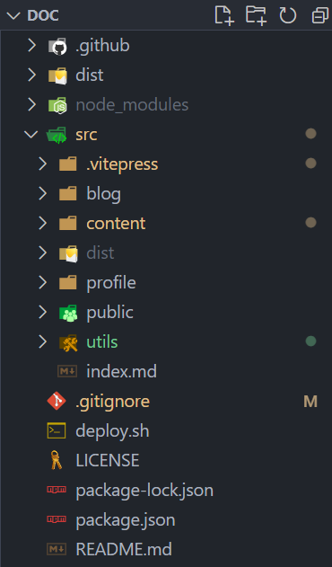
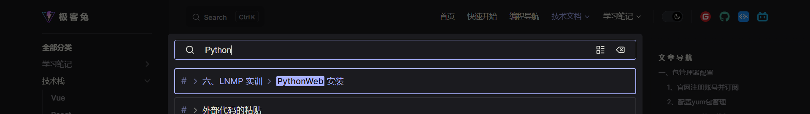
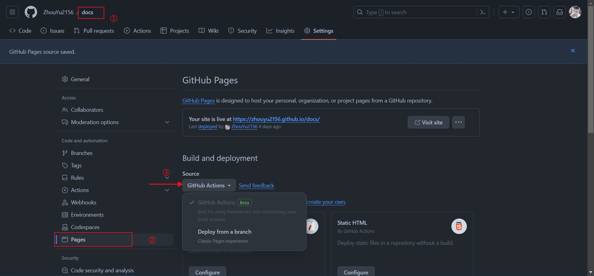
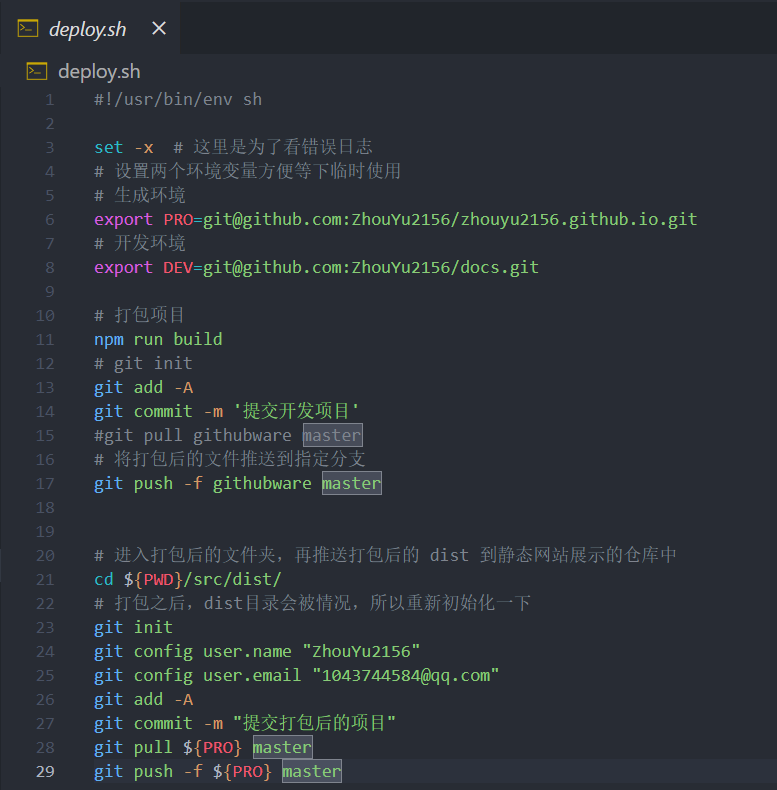
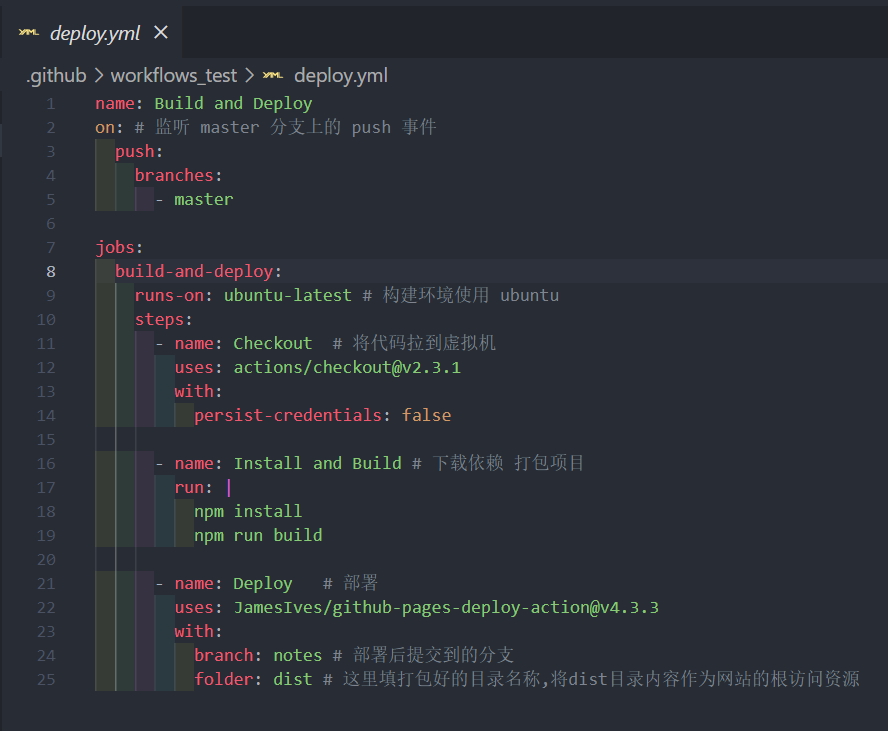

<Button>Primary Button</Button>

**加粗后的样式**

::: code-group
```vue
<script setup lang='ts'>
import {ref} from 'vue'  
</script>

<template>
    <div class="display-block w-100vw">
        <iframe src="/profile.pdf" frameborder="0" class="w-100 h-100vh"></iframe>
    </div>
</template>

<style scoped></style>
```

```json
"scripts": {
    "docs:dev": "vitepress dev docs",
    "docs:build": "vitepress build docs",
    "docs:preview": "vitepress preview docs"
  },
```

:::

# 项 目 说 明

> `⭐️ 新学的技术，用来方便写个人博客和笔记，并且从这个新的技术中也学到了很多有用的东西，可以帮助自己快速搭建自己的博客网站，记录并分享自己的知识笔记等，最主要是，它支持自定义主题样式，意味着我们可以去重写默认的样式，实现个性化的主题定制，另外也学习到了算是工作中非常有用的自动化部署技术。`

> `🚀` 技术选型：
> - Vue
> - React
> - Vite
> - Git
> - markdown
> - VuePress
> - Bootstrap5
> - Github Workflow
> - Shell 脚本

## 🎉 项目目标
> 实现快速轻松搭建个人博客和笔记分享的网站，并且实现一键自动化部署。


## 个人技术栈
::: tip 简介
`⭐️ ⭐️ ⭐️ ⭐️ ⭐️`

  ✅ H5、CSS3、JS

  ✅ React 全家桶

  ✅ Vue 全家桶

  ✅ Node.js 后端开发

  ✅ Git

  ✅ ElementUI 组件库

  ✅ VantUI 组件库

  ✅ AntdUI 组件库

  ✅ LayUI 组件库

  ✅ Bootstrap

  ✅ jquery

  ✅ axios

  ✅ Express

  ✅ TypeScript

  ✅ Less

  ✅ Webpack

  ✅ 熟悉 Ajax 和 HTTP 协议

  ✅ MySQL 数据库

  ✅ Flask

  ✅ Django

  ✅ Markdown

  ✅ Linux 系统管理

  ✅ Nginx

  ✅ 了解 React和Vue的SSR技术，如Nextjs和Nuxtjs

  ✅ 自动化部署

  ✅ 了解每种主流编程语言，C、C++、Java，个人主要使用的是 Python、JavaScript

  ✅ 前端优化策略等

  ✅ . . . . . . 

:::

## 项目搭建
```bash
$ npm init -y             # 初始化 package.json 包管理文件
$ npm add -D vitepress    # 安装项目依赖 vue 自带着一起安装
$ npx vitepress init      # 初始化vitepress模板
```
- 在 package.json 中添加如下命令
```json
"scripts": {
    "docs:dev": "vitepress dev docs",
    "docs:build": "vitepress build docs",
    "docs:preview": "vitepress preview docs"
  },
```
- 启动项目
```vue
<script setup lang='ts'>
import {ref} from 'vue'  
</script>

<template>
    <div class="display-block w-100vw">
        <iframe src="/profile.pdf" frameborder="0" class="w-100 h-100vh"></iframe>
    </div>
</template>

<style scoped></style>
```

## 项目介绍

<GradientTitle text="项 目 结 构"/>


<GradientTitle text="智 能 搜 索"/>



<GradientTitle text="实 现 自 动 化"/>
- ### github 设置


- ### 项目自动化提交


- ### 自动化部署



...

## 未来的计划
::: info 说明
- 生成链接，根据笔记目录自动批量生成路径
- 生成时间线，根据笔记生成时间自动生成时间线
- 自定义定制主题，实现自己个性化的主题效果
- 丰富内容，使网站拥有更多元的功能，如：背景音乐、分类标签、网页宠物
- 加入 Algolia Search
:::


