<GradientTitle text="Git 静态部署"/>


## 一、Github 静态部署


### 1、新建仓库


- 找到新建仓库的按钮

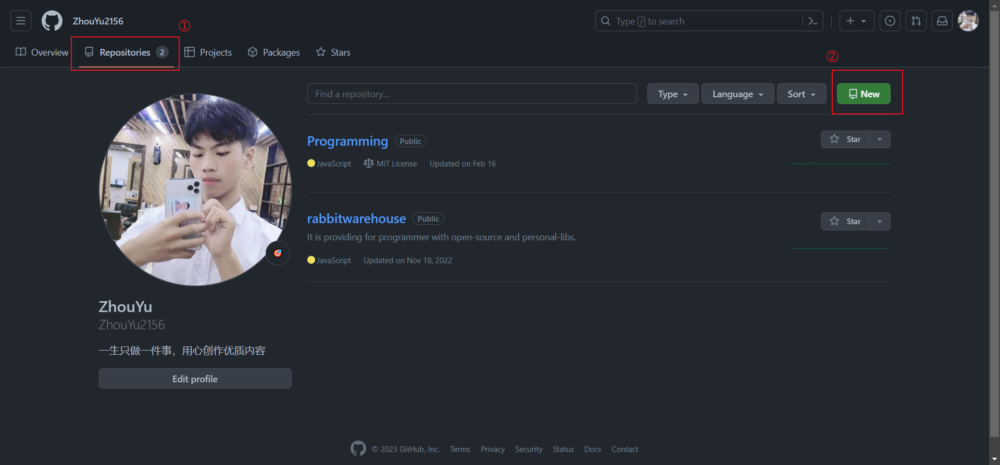


- 填写信息（域名必须是可用状态）

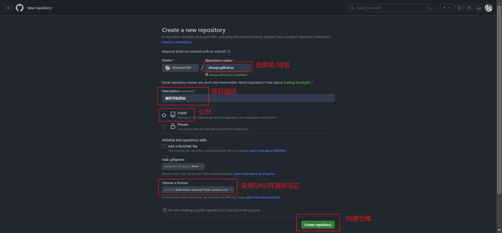


### 2、初始化本地仓库


- 创建项目目录

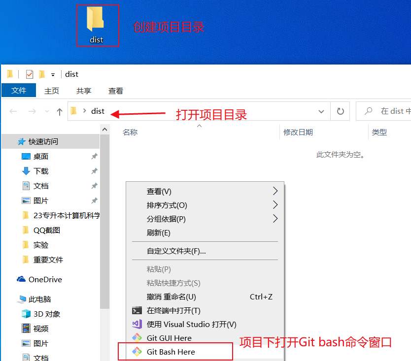


- ssh 链接（我采用的方式）

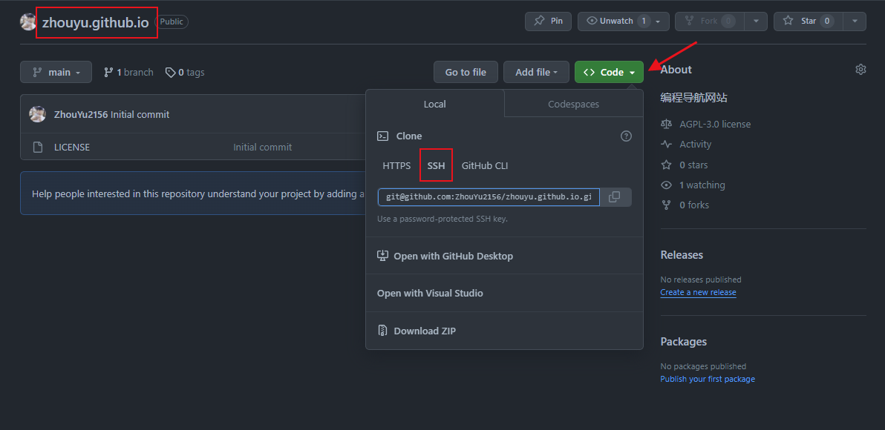


- Git 初始化项目

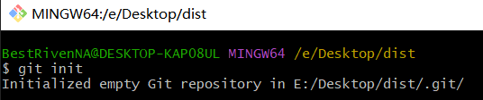


- 添加项目的远程仓库

> 可以用上面看到的 ssh 连接的地址，

```bash
$ git remote add githubware [自己的仓库地址]	# 添加项目的远程仓库
$ git remote -v								 # 查看当前项目配置的远程仓库
```

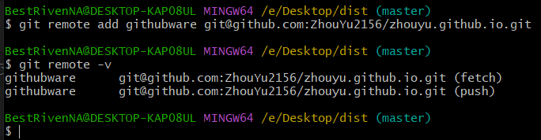


- 创建一个测试文件

```bash
$ echo "Hello World!" > index.html
```

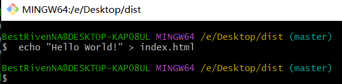


- 添加到本地仓库

```bash
$ git add .										# 添加当前下的所有文件到暂存区
$ git status									# 查看文件跟踪状态
$ git commit -m "github静态部署搭建测试网站"		# 提交到本地仓库
```


### 3、推送到远程

```bash
$ git push githubware master			# 将本地仓库里的文件推送到远程仓库
```

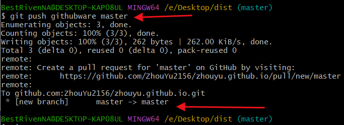


- 仓库更新

> :warning:记得刷新一下浏览器页面

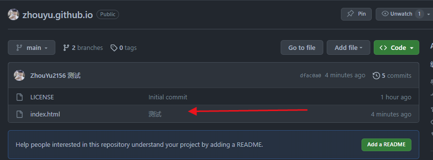


- 两个主分支的问题 ?

``` bash
$ git branch -m master main				# 将『旧分支名』改为『新的分支名』
$ git branch -a							# 查看当前仓库的分支
$ git push githubware --delete master	# 将刚才推送到远程仓库的master分支删除掉
$ git pull githubware main --allow-unrelated-histories	# 先拉取远程仓库与本地进行同步
# 此命令基本上就是git fetch 和git merge命令的组合体，Git从指定的仓库中抓取内容，然后尝试将其合并进你所在的分支里
$ echo "修改的内容，尝试再次推送" > index.html
$ git push -u githubware main			# 推送到远程仓库的主分支
```

> - [x] 推荐：[参考文献](https://blog.csdn.net/qyfx123456/article/details/129531549)


### 4、配置远程仓库部署

- 配置

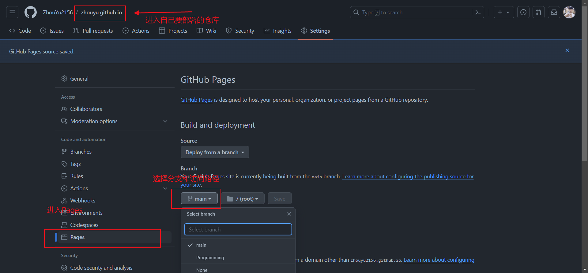


- 访问

> :warning:注意：访问的时候是你的`github域名+仓库名+路径名`的形式访问，具体的路径看你是把那个作为根路径，比如上面我是在主分支下直接创建了一个`index.html`文件，并且配置的是将主分支下的根目录作为网站的访问路径，那么我就应该访问:https://zhouyu2156.github.io/zhouyu.github.io/ ,默认访问的是该路径下的`index.html`文件，比如，我还有一个静态项目需要部署，我新建了一个仓库叫`Programming`,之后我把打包好的资源放在该仓库中之后，我访问的`URL`就应该是:https://zhouyu2156.github.io/Programming/ ,当然默认地访问也是该路径下的 `index.html`网页。
>
> :white_check_mark:总结：访问地址就是：`github给你分配的子域名+仓库名+路径`

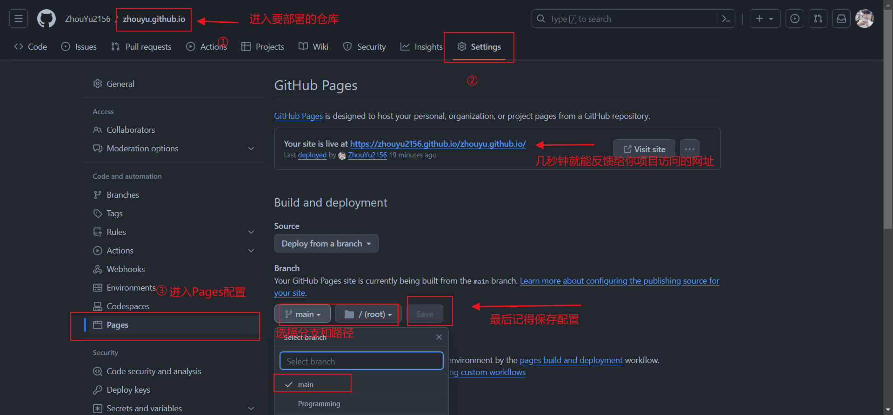


- URL访问对比图

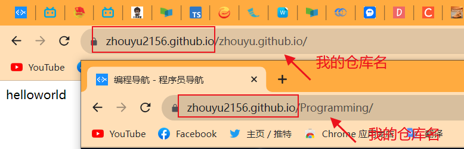


### 5、设置域名为根路径


- 部署 `username.github.io` 命名的仓库

> github 会将名字为 `username.github.io` 的仓库下的内容直接地自动构建到 `https://username.github.io` 域名下。<code>/</code> 后面就正常接资源的层级路径访问即可。（不需要开 `Github Pages服务`, Github 会帮你自动构建）


- 部署普通仓库

> 部署非上面命名的仓库。
>
> 首先，建造的一个仓库，随便命名，比如 `common-repos`；
>
> 其次，免费的GitHub Pages只支持public仓库，所以需要设置仓库为`开源的`;
>
> 最后，你需要在`该仓库的设置菜单里`手动`开启该仓库的GitHub Pages功能`，你可以将该仓库的`/`设置成静态网站`根`，也可以选择该仓库下的文档目录`docs`作为静态网站`根`。:white_check_mark:网站的根目录就是你设置的文件目录。
>
> :warning:如果你的仓库是`private`私有的，可以将它设置为`public`公开的，然后再按照上面的方式部署。
>
> :white_check_mark:以上操作准备就绪后，耐心等待几秒，你部署的静态网站的网址就类似这样：`https://username.github.io/common-repos/`。~~如果是将项目的文档`docs目录`设置为网站根，那么访问的就应该还是 `https://username.github.io/common-repos/`，这个我还没尝试，不知道是不是这样，但是凭我程序员的直觉，感觉应该是这样的，如果不是这样的话，那么就是 `https://username.github.io/common-repos/docs/`。~~ `上面已经解释`。


### 6、自动化部署

> :warning:请参考网上教程，博主也正在学习该技术:exclamation:

<code style="border: 1px solid skyblue; color: orange; padding: 5px 15px; margin: 10px;">推荐:[参考文献 \- 阮一峰的 GitHub Actions 入门教程](https://www.ruanyifeng.com/blog/2019/09/getting-started-with-github-actions.html)</code>


## 二、Gitee 静态部署

> 由于 `Gitee` 是国内根据 `Github` 仿制出来的，所以操作步骤跟上面差不多，不再展开细说了，如果有任何问题可以参考网上教程。